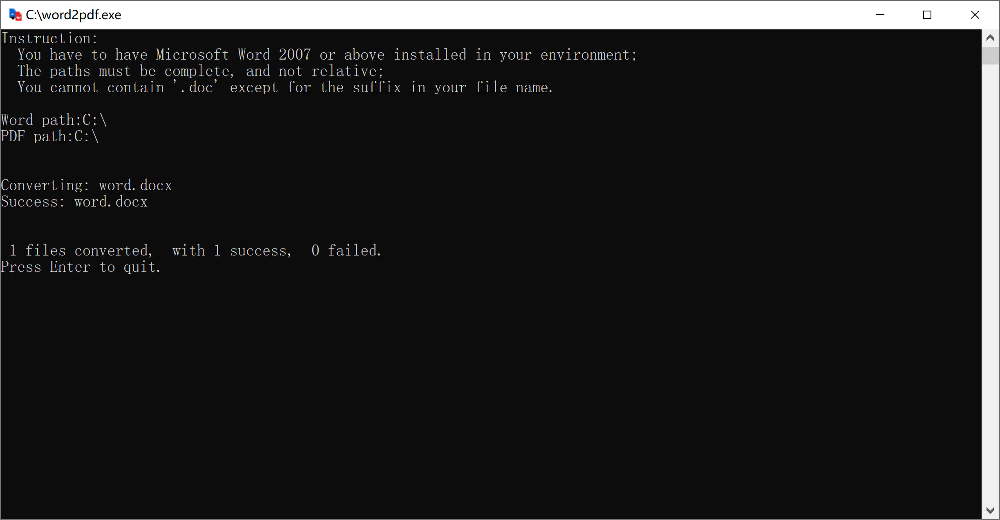

# word2pdf
   

## Introduction
Convert mass word files to pdf files, using a software packaged with python.  
Only needed to enter your Word's path and the target PDF path, and let the program do the rest.  
(No python required)  

  

**Supported files:**  
- `.docx`
- `.doc`

**Requirements:**  
- Must have Microsoft Word 2007 or above installed in your environment.
- Only supported in Windows.

## Download
You may run [the python file](word2pdf.py) yourself for dev, or just [download the software](https://github.com/katorlys/word2pdf/raw/main/dist/word2pdf.exe).  